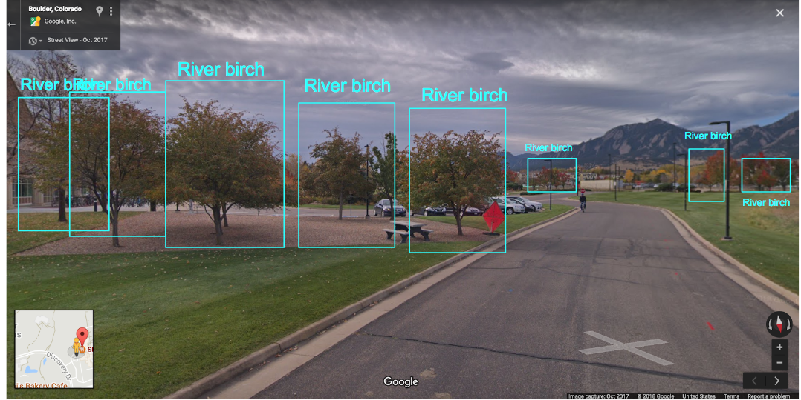
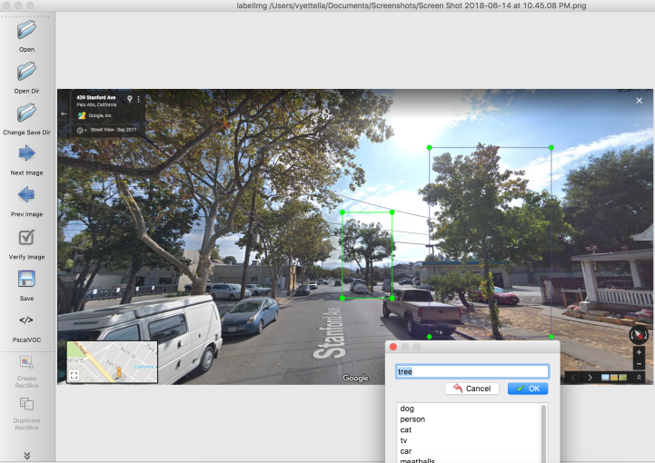

# Not So Random Forest

Tree monitoring, at scale

#### Abstract  

Locate trees and identify species in street view imagery.

Trees are an important part of a city’s landscape, providing a variety of benefits. Maintaining a city’s tree cover is expensive, requiring thousands of volunteer hours and several hundred thousand dollars every year.

**Not So Random Forest** is an AI platform that solves this problem by automating large-scale urban tree monitoring. Using deep learning techniques on Google street view imagery, the platform aims to enable, at the click of a button, rapid localization, species classification and health monitoring of trees on a city-wide scale.

Because labeled tree imagery is not freely available, I build and train models on hand-labeled tree images. Installation instructions, labeling approaches and model description are given below.

Google slides can be found [here](http://bit.ly/notsorandomforest)

## Installation

Python packages required for this project are listed in `requirements.txt` and can be installed via

`pip install -r requirements.txt`

## Examples

A notebook with a step-by-step list of instructions to run inference on images is found here.

## Data

Training object detectors requires bounding box annotations of objects of interest. Getting quality bounding box annotations of trees proved to be surprisingly hard. While Imagenet provides tree annotations ([here](http://image-net.org/download-bboxes)), I found the quality of these annotations to be far from desirable. For example, many of these annotations bounded only foliage and not entire trees.

I ultimately decided to create my own tree annotations. I found [LabelImg](https://github.com/tzutalin/labelImg) to be a very useful tool for this purpose. I ended up creating annotations for 300 street view images that may be downloaded from [dropbox](https://www.dropbox.com/s/uca05wzwkhe631y/annotations.zip?dl=0).

LabelImg outputs annotations as XML files in the PASCAL VOC format that need to be converted to CSV for training RetinaNet. To facilitate this conversion, I include `xml_to_csv.py` in the [utils](utils) folder.

For the species classification task, I obtained training data from google images using javascript snippets available [here](https://www.pyimagesearch.com/2017/12/04/how-to-create-a-deep-learning-dataset-using-google-images/). Many of the images included background that is irrelevant to the classification task. I used [photo_splitter.py](https://github.com/dnouri/photo_splitter) to rapidly iterate through the downloaded images and crop out irrelevant backgrounds and isolate trees of interest. A modified version of photo_splitter.py is included in the [utils](utils) folder. The dataset that the classifier was trained on can be downloaded from [dropbox](https://www.dropbox.com/s/dwokzimqe7b7s3c/classification.zip?dl=0)

## Models

Tree detection and species classification proceeds in two steps. First a detection model locates trees in an image of interest and outputs detected trees as standalone images. The outputs of the detector are then piped to a classifier that predicts species.

### Object Detection

The project leverages [RetinaNet](https://arxiv.org/pdf/1708.02002.pdf), a state-of-the-art object detection model. RetinaNet improves upon previous architectures by implementing "focal loss", a weighted loss function, that addresses class imbalance between objects of interest and the image background.

Rather than building RetinaNet from scratch, I adapted an existing Keras implementation from [fizyr](https://github.com/fizyr/keras-retinanet) for this project. I included it as a submodule in the [models](models) folder. Instructions to install and train RetinaNet can be found [here](models/retinanet).

### Species Classification

Since I was consulting with the city of Athens [Greece] for this project, I focused on tree species in that city. I obtained a list of the 18 most commonly occurring species in Athens from a [sample survey](https://www.tandfonline.com/doi/abs/10.1080/03071375.1988.9756380).

It is often useful to approach classification tasks using a baseline model and then improve upon the results by either tuning the model or choosing a more complex model that is able to generalize better. Accordingly, I decided to start with a non deep learning approach. Specifically, I resorted to Principal Component Analysis to extract the most important features of trees [dubbed 'eigentrees'] and trained an SVM on the projections of the training data onto the eigentrees. This relatively simple approach did not yield particularly useful results with the mean precision and recall across tree species being 0.20. I included a notebook detailing the analysis [here](models/training/species_classifier_baseline_pca_svm.ipynb).

Since the baseline model did not have a whole lot of predictive power, I decided to use deep learning for classification. This however proved challenging due to the limited amount of species data I could scrape from Google images (~100 images each for 18 species). Inference with out-of-the-box models topped out at 50% validation accuracy which is significantly better than random guessing on 18 classes but nowhere near human-level accuracy. Applying aggressive data augmentation and techniques that aim to prevent overfitting [e.g: regularization, dropout] improved the accuracy upto 68%. I am currently working on [fine tuning](https://flyyufelix.github.io/2016/10/03/fine-tuning-in-keras-part1.html) approaches to improve the accuracy further.

A different approach that's giving promising results is the [One-vs-Rest](https://en.wikipedia.org/wiki/Multiclass_classification) strategy. This method entails training a single classifier per species, with the images of that species as positive examples and all other images as negative. At inference time, all 18 classifiers are applied to the unseen image and the species corresponding to the classifier that gives the highest probability is output as the prediction. This approach yielded validation accuracies as high as 90%.

A drawback of the One-vs-Rest approach is that it takes a longer time for inference than a single model. This can be mitigated by replacing InceptionV3 with a simpler model as the backbone. This may be done by including a simpler model of choice under `custom_nn()` in `./models/species_classifier_cnn.py` and calling it from the command line using the `Custom` argument:  

 `python species_classifier_cnn.py --dir <path_to_image_folder> --classifier Custom`

 ## Inference

 Inference maybe run on desired images using inference.py in the [models](models) folder:  

 `python inference.py --dir <path_to_image_folder> --detector <path_to_classifier_model> --classifier <path_to_detector_model>`

 Inference results are pickled and saved in the same directory as images. Sample results are visualized [here](models/visualize_results.ipynb).
